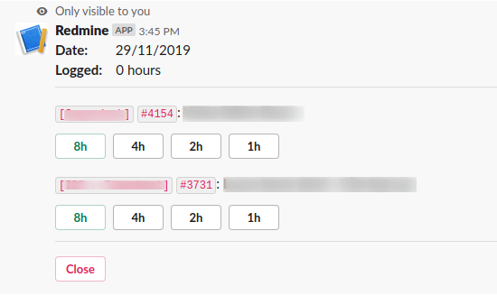

# Redmine logtime reminder bot

A Slack bot remind you to [log time](https://www.redmine.org/projects/redmine/wiki/RedmineTimeTracking) everyday

See more at [images](images/README.md)

## INSTALLTION
See [INSTALLTION.md](INSTALLATION.md)

## USAGE
From your Slack app, type `/command config` (with command is your Redmine bot slash command), choose **Edit**.

It will display a modal, from here, put your Redmine API (get at `YOUR_REDMINE_URL/my/account`), click submit.

NOTE: To use **Remind At** function (which will automatically send logtime message), you must setup a crob task to send request to `/api/trigger` as instructed in [INSTALLTION.md](INSTALLATION.md#Cron)

Then type `/command log` to log time, by default, it will only display first 5 (open) issues, to further customize how issues are listed, use `/command config full`

**Advance config**

+ List issues assigned to me only: List all issues that assignee is you
+ List issues created by me only: List all issues that you have created
+ Show confirm dialog: Whether to show confirm dialog on logtime or not
+ Custom query: Custom query that redmine API support, in addition to `assign_to_id` and `author_id` (e.g. project_id=my_project). For more info, see [Redmine Rest issues API](https://www.redmine.org/projects/redmine/wiki/Rest_Issues)

## KNOWN ISSUES
These are known issues because Slack valid request time is too short and funcion need time to compile (especially first request when function just deployed or cold start)

- **failed with the error "operation_timeout"** when running slash command.
- Error when submit config.

If you encounter these, just retry your action (e.g. re-submit form) and it will process your request as normal.

# LICENSE
MIT